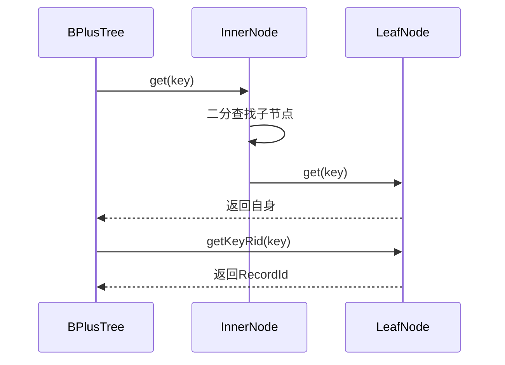

# Project 2: B+ Trees

## Project Structure Diagram

## 项目结构图


## Task1: `LeafNode::fromBytes`

> You should first implement the `fromBytes` in `LeafNode`. This method reads a `LeafNode` from a page. For information on how a leaf node is serialized, see `LeafNode::toBytes`. For an example on how to read a node from disk, see `InnerNode::fromBytes`. Your code should be similar to the inner node version but should account for the differences between how inner nodes and leaf nodes are serialized. You may find the documentation in [`ByteBuffer.java`](https://github.com/Tinuvile/cs186/blob/main/cs186-sp25-rookiedb/src/main/java/edu/berkeley/cs186/database/common/ByteBuffer.java) helpful.  
> Once you have implemented `fromBytes` you should be passing `TestLeafNode::testToAndFromBytes`.

`toBytes`和`fromBytes`分别是用来将节点序列化为字节流和反序列化的代码。而 LeafNode 与 InnerNode 大致相同，照着写即可。唯一需要注意的是`rightSibling`，我一开始没有处理右指针为-1 的情况。具体实现为：

```java
public static LeafNode fromBytes(BPlusTreeMetadata metadata, BufferManager bufferManager,
                                     LockContext treeContext, long pageNum) {
        // TODO(proj2): implement
        // Note: LeafNode has two constructors. To implement fromBytes be sure to
        // use the constructor that reuses an existing page instead of fetching a
        // brand new one.
        Page page = bufferManager.fetchPage(treeContext, pageNum);
        Buffer buf = page.getBuffer();

        byte nodeType = buf.get();
        assert(nodeType == (byte) 1);

        long rightSibling = buf.getLong();
        Optional<Long> rightSiblingOpt = (rightSibling == -1L) ? Optional.empty() : Optional.of(rightSibling);

        List<DataBox> keys = new ArrayList<>();
        List<RecordId> rids = new ArrayList<>();

        int n = buf.getInt();
        for (int i = 0; i < n; ++i) {
            keys.add(DataBox.fromBytes(buf, metadata.getKeySchema()));
            rids.add(RecordId.fromBytes(buf));
        }

        return new LeafNode(metadata, bufferManager, page, keys, rids, rightSiblingOpt, treeContext);
    }
```

运行测试，通过：


## Task 2: `get`, `getLeftmostLeaf`, `put`, `remove`

> After implementing `fromBytes`, you will need to implement the following methods in `LeafNode`, `InnerNode`, and `BPlusTree`:
> 
> - `get`
> - `getLeftmostLeaf` (LeafNode and InnerNode only)
> - `put`
> - `remove`
> 
> For more information on what these methods should do refer to the comments in `BPlusTree` and `BPlusNode`.
> 
> Each of these methods, although split into three different classes, can be viewed as one recursive action each - the `BPlusTree` method starts the call, the `InnerNode` method is the recursive case, and the `LeafNode` method is the base case. It's suggested that you work on one method at a time (over all three classes).
> 
> We've provided a `sync()` method in `LeafNode` and `InnerNode`. The purpose of `sync()` is to ensure that the representation of a node in our buffers is up-to-date with the representation of the node in program memory.
> 
> Do not forget to call `sync()` when implementing the two mutating methods (`put` and `remove`); it's easy to forget.

### 1. `get`函数

- `BPlusTree`为`get`的入口层，负责控制整体流程。首先从根节点开始导航，经过递归查找到叶子节点，并查找实际的键值；

- `InnerNode`为路由层，通过二分查找与递归返回叶子节点；

- `LeafNode`为终端层，负责查找实际键值。



这里我从`InnerNode`的`get`开始：

```java
public LeafNode get(DataBox key) {
        int index = InnerNode.numLessThanEqual(key, keys);
        BPlusNode child = getChild(index);
        return child.get(key);
    }
```

`numLessThanEqual`方法直接找到小于等于`key`对应的索引，然后进行递归。这里我们把`child`的类型定义为`BPlusNode`抽象类，`child.get(key)`会自动处理递归，根据`child`的类型分别调用两个类里面的`get`方法。

注意写完以后直接运行`TestInnerNode`中的`testGet`测试并不会通过，因为递归的终止情况是`child`的类型为`LeafNode`然后调用对应的`get`方法，目前这里返回的是`null`，需要完成`LeafNode`中的`get`方法：

```java
public LeafNode get(DataBox key) {
        return this;
    }
```

再分别运行`TestLeafNode`中的`testGetL`和`TestInnerNode`中的`testGet`，就可以通过啦。


再去写`BPlusTree`中的`get`方法：

```java
public Optional<RecordId> get(DataBox key) {
        typecheck(key);
        // TODO(proj4_integration): Update the following line
        LockUtil.ensureSufficientLockHeld(lockContext, LockType.NL);

        // TODO(proj2): implement
        LeafNode leaf = root.get(key);

        return leaf.getKey(key);
    }
```

### 2. `getLeftmostLeaf`函数