# Project 2: B+ Trees

## Project Structure Diagram

## 项目结构图

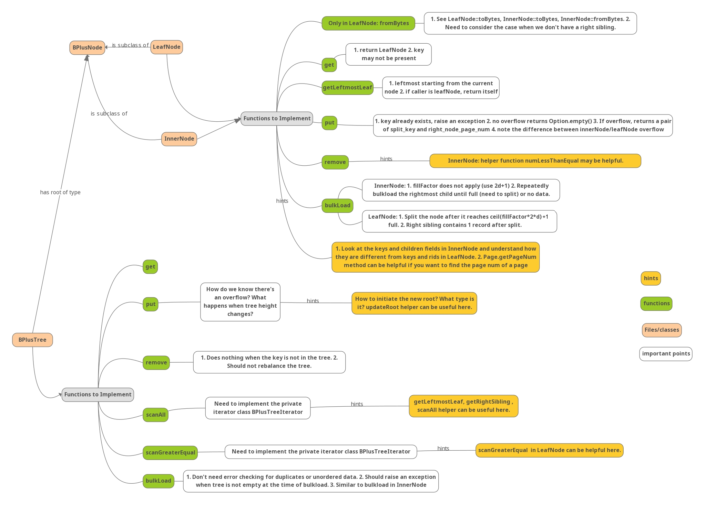

## Task1: `LeafNode::fromBytes`

> You should first implement the `fromBytes` in `LeafNode`. This method reads a `LeafNode` from a page. For information on how a leaf node is serialized, see `LeafNode::toBytes`. For an example on how to read a node from disk, see `InnerNode::fromBytes`. Your code should be similar to the inner node version but should account for the differences between how inner nodes and leaf nodes are serialized. You may find the documentation in [`ByteBuffer.java`](https://github.com/Tinuvile/cs186/blob/main/cs186-sp25-rookiedb/src/main/java/edu/berkeley/cs186/database/common/ByteBuffer.java) helpful.  
> Once you have implemented `fromBytes` you should be passing `TestLeafNode::testToAndFromBytes`.

`toBytes`和`fromBytes`分别是用来将节点序列化为字节流和反序列化的代码。而 LeafNode 与 InnerNode 大致相同，照着写即可。唯一需要注意的是`rightSibling`，我一开始没有处理右指针为-1 的情况。具体实现为：

```java
public static LeafNode fromBytes(BPlusTreeMetadata metadata, BufferManager bufferManager,
                                     LockContext treeContext, long pageNum) {
        // TODO(proj2): implement
        // Note: LeafNode has two constructors. To implement fromBytes be sure to
        // use the constructor that reuses an existing page instead of fetching a
        // brand new one.
        Page page = bufferManager.fetchPage(treeContext, pageNum);
        Buffer buf = page.getBuffer();

        byte nodeType = buf.get();
        assert(nodeType == (byte) 1);

        long rightSibling = buf.getLong();
        Optional<Long> rightSiblingOpt = (rightSibling == -1L) ? Optional.empty() : Optional.of(rightSibling);

        List<DataBox> keys = new ArrayList<>();
        List<RecordId> rids = new ArrayList<>();

        int n = buf.getInt();
        for (int i = 0; i < n; ++i) {
            keys.add(DataBox.fromBytes(buf, metadata.getKeySchema()));
            rids.add(RecordId.fromBytes(buf));
        }

        return new LeafNode(metadata, bufferManager, page, keys, rids, rightSiblingOpt, treeContext);
    }
```

运行测试，通过：

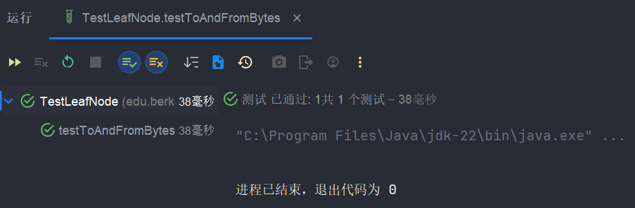

## Task 2: `get`, `getLeftmostLeaf`, `put`, `remove`

> After implementing `fromBytes`, you will need to implement the following methods in `LeafNode`, `InnerNode`, and `BPlusTree`:
> 
> - `get`
> - `getLeftmostLeaf` (LeafNode and InnerNode only)
> - `put`
> - `remove`
> 
> For more information on what these methods should do refer to the comments in `BPlusTree` and `BPlusNode`.
> 
> Each of these methods, although split into three different classes, can be viewed as one recursive action each - the `BPlusTree` method starts the call, the `InnerNode` method is the recursive case, and the `LeafNode` method is the base case. It's suggested that you work on one method at a time (over all three classes).
> 
> We've provided a `sync()` method in `LeafNode` and `InnerNode`. The purpose of `sync()` is to ensure that the representation of a node in our buffers is up-to-date with the representation of the node in program memory.
> 
> Do not forget to call `sync()` when implementing the two mutating methods (`put` and `remove`); it's easy to forget.

### 1. `get`函数

- `BPlusTree`为`get`的入口层，负责控制整体流程。首先从根节点开始导航，经过递归查找到叶子节点，并查找实际的键值；

- `InnerNode`为路由层，通过二分查找与递归返回叶子节点；

- `LeafNode`为终端层，负责查找实际键值。

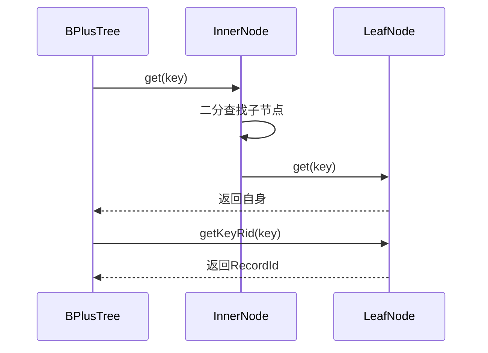

这里我从`InnerNode`的`get`开始：

```java
public LeafNode get(DataBox key) {
        int index = InnerNode.numLessThanEqual(key, keys);
        BPlusNode child = getChild(index);
        return child.get(key);
    }
```

`numLessThanEqual`方法直接找到小于等于`key`对应的索引，然后进行递归。这里我们把`child`的类型定义为`BPlusNode`抽象类，`child.get(key)`会自动处理递归，根据`child`的类型分别调用两个类里面的`get`方法。

注意写完以后直接运行`TestInnerNode`中的`testGet`测试并不会通过，因为递归的终止情况是`child`的类型为`LeafNode`然后调用对应的`get`方法，目前这里返回的是`null`，需要完成`LeafNode`中的`get`方法：

```java
public LeafNode get(DataBox key) {
        return this;
    }
```

再分别运行`TestLeafNode`中的`testGetL`和`TestInnerNode`中的`testGet`，就可以通过啦。

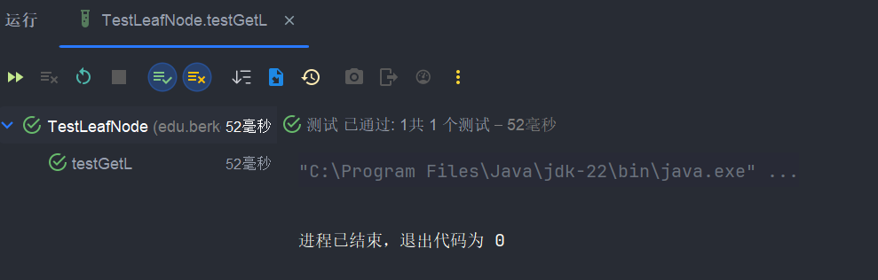

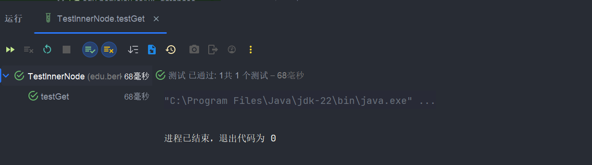

再去写`BPlusTree`中的`get`方法：

```java
public Optional<RecordId> get(DataBox key) {
        typecheck(key);
        // TODO(proj4_integration): Update the following line
        LockUtil.ensureSufficientLockHeld(lockContext, LockType.NL);

        // TODO(proj2): implement
        LeafNode leaf = root.get(key);

        return leaf.getKey(key);
    }
```

### 2. `getLeftmostLeaf`函数

跟上面的思路其实差不多，先实现`LeafNode`里的：

```java
public LeafNode getLeftmostLeaf() {
        return this;
    }
```

因为`n.getLeftmostLeaf`要求是返回以`n`为根节点的子树的最左节点，叶节点在最底层直接返回自己即可。测试通过：

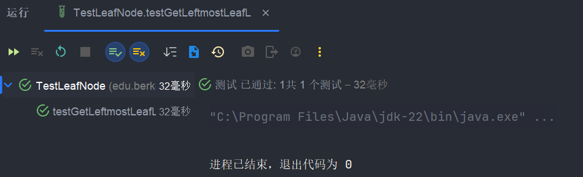

然后来写`InnerNode`的，很简单：

```java
public LeafNode getLeftmostLeaf() {
        assert(children.size() > 0);
        BPlusNode child = getChild(0);
        return child.getLeftmostLeaf();
    }
```

运行测试通过：

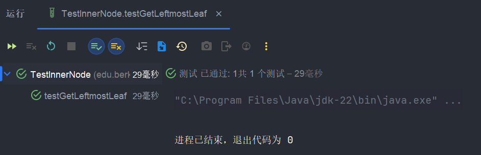

### 3. `put`函数

整体思路大致如下：

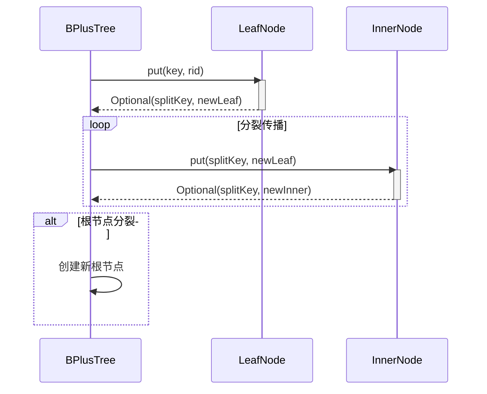

首先写`LeafNode`中的`put`函数，这个函数需要检查是否有重复键，并将其插入到正确位置，如果出现溢出，再分裂叶子节点，并返回中间键和新节点的指针。具体实现如下：

```java
public Optional<Pair<DataBox, Long>> put(DataBox key, RecordId rid) {
        // TODO(proj2): implement

        // 检查重复键
        if (keys.contains(key)) {
            throw new BPlusTreeException("Leaf already has the key");
        }

        // 利用numLessThan函数寻找插入位置并执行
        int index = InnerNode.numLessThan(key, keys);
        keys.add(index, key);
        rids.add(index, rid);

        // 最大键数
        int maxKeys = 2 * metadata.getOrder();

        // 如果没有溢出
        if (keys.size() <= maxKeys) {
            sync();
            return Optional.empty();
        }

        // 溢出情况
        // 获取中间键
        int splitIndex = maxKeys / 2;
        DataBox splitKey = keys.get(splitIndex);

        // 创建新的叶子节点
        List<DataBox> rightKeys = new ArrayList<>(keys.subList(splitIndex, keys.size()));
        List<RecordId> rightRids = new ArrayList<>(rids.subList(splitIndex, rids.size()));
        LeafNode rightSibling = new LeafNode(metadata, bufferManager, rightKeys, rightRids, this.rightSibling, treeContext);

        // 更新旧的叶子节点
        keys = new ArrayList<>(keys.subList(0, splitIndex));
        rids = new ArrayList<>(rids.subList(0, splitIndex));
        this.rightSibling = Optional.of(rightSibling.getPage().getPageNum());
        sync();

        return Optional.of(new Pair<>(splitKey, rightSibling.getPage().getPageNum()));
    }
```

运行测试验证（共三个测试）：

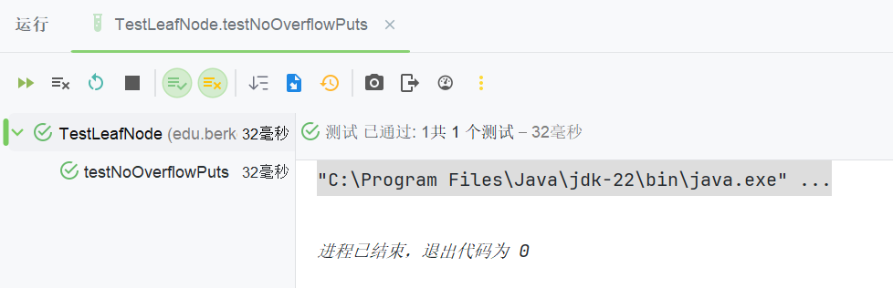

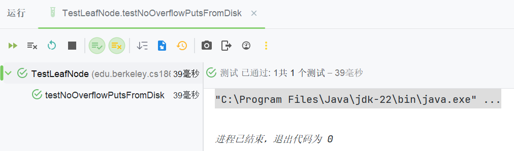

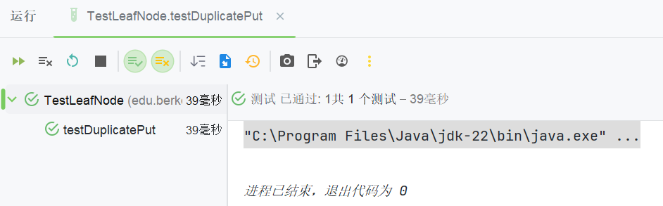

均通过🥰🥰🥰。

然后来写`InnerNode`部分，按照思路设计，内部节点需要分裂时循环调用的逻辑放在`BPlusTree`中实现，在这部分中我们只实现一次的情况即可。

```java
public Optional<Pair<DataBox, Long>> put(DataBox key, RecordId rid) {
    // 找到合适的子节点索引
    int index = InnerNode.numLessThanEqual(key, keys);
    BPlusNode child = getChild(index);

    // 递归插入到子节点
    Optional<Pair<DataBox, Long>> result = child.put(key, rid);

    if (result.isPresent()) {
        // 子节点分裂，插入中间键和新节点指针
        Pair<DataBox, Long> splitResult = result.get();
        keys.add(index, splitResult.getFirst());
        children.add(index + 1, splitResult.getSecond());

        // 检查当前节点是否溢出
        if (keys.size() > 2 * metadata.getOrder()) {
            // 分裂当前节点
            int mid = metadata.getOrder();
            DataBox splitKey = keys.get(mid);

            // 创建新节点
            List<DataBox> rightKeys = keys.subList(mid + 1, keys.size());
            List<Long> rightChildren = children.subList(mid + 1, children.size());
            InnerNode right = new InnerNode(metadata, bufferManager, rightKeys, rightChildren, treeContext);

            // 更新当前节点
            keys = keys.subList(0, mid);
            children = children.subList(0, mid + 1);
            sync();

            return Optional.of(new Pair<>(splitKey, right.getPage().getPageNum()));
        }
        sync();
    }
    return Optional.empty();
}
```

运行测试通过：

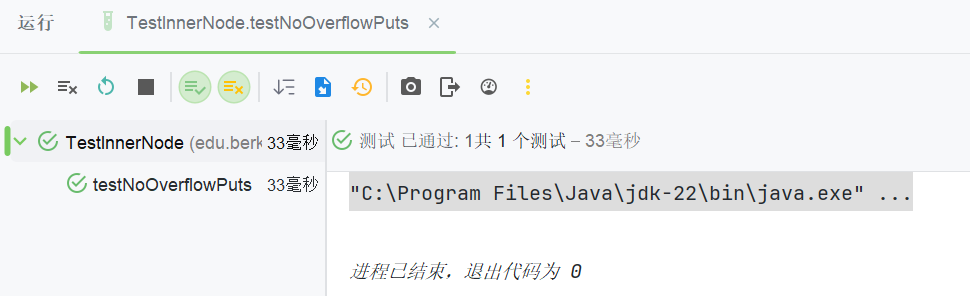

最后写`BPlusTree`的`put`部分，其中处理根节点分裂的逻辑：

```java
public void put(DataBox key, RecordId rid) {
        typecheck(key);
        // TODO(proj4_integration): Update the following line
        LockUtil.ensureSufficientLockHeld(lockContext, LockType.NL);

        // TODO(proj2): implement
        // Note: You should NOT update the root variable directly.
        // Use the provided updateRoot() helper method to change
        // the tree's root if the old root splits.
        Optional<Pair<DataBox, Long>> result = root.put(key, rid);

        if (result.isPresent()) {
            List<DataBox> keys = new ArrayList<>();
            keys.add(result.get().getFirst());

            List<Long> children = new ArrayList<>();
            children.add(root.getPage().getPageNum());
            children.add(result.get().getSecond());

            InnerNode newRoot = new InnerNode(metadata, bufferManager, keys, children, lockContext);
            updateRoot(newRoot);
        }
    }
```

但由于`scanAll`函数尚未完成，无法通过`testRandomPuts()`测试。

### `remove`函数

依然是先写`LeafNode`部分，比较简单：

```java
public void remove(DataBox key) {
        // TODO(proj2): implement
        int index = keys.indexOf(key);
        if (index == -1) {
            throw new BPlusTreeException("Leaf does not have the key");
        }

        keys.remove(index);
        rids.remove(index);
    }
```

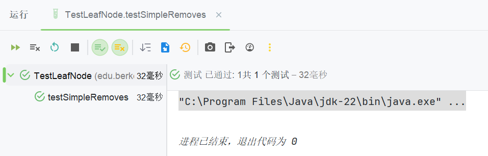

但我在写`InnerNode`部分遇到问题，测试一直失败，应该是没有`sync`的问题，修改`LeafNode`代码：

```java
public void remove(DataBox key) {
        int index = Collections.binarySearch(keys, key);
        if (index == -1) {
            throw new BPlusTreeException("Leaf does not have the key");
        }

        keys.remove(index);
        rids.remove(index);

        sync();
    }
```

再写`InnerNode`部分代码：

```java
public void remove(DataBox key) {
        // TODO(proj2): implement
        int index = InnerNode.numLessThanEqual(key, keys);
        BPlusNode child = getChild(index);
        child.remove(key);
        sync();
    }
```

测试通过

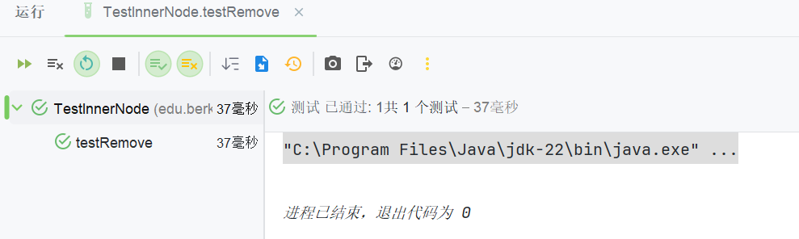

再完成`BPlusTree`的`remove`部分：

```java
public void remove(DataBox key) {
        typecheck(key);
        // TODO(proj4_integration): Update the following line
        LockUtil.ensureSufficientLockHeld(lockContext, LockType.NL);

        // TODO(proj2): implement
        root.remove(key);
    }
```

那么**Task2**就完成了。

## Task 3: Scans

> You will need to implement the following methods in `BPlusTree`:
> 
> - `scanAll`
> 
> - `scanGreaterEqual`
> 
> In order to implement these, you will have to complete the [`BPlusTreeIterator`](https://github.com/berkeley-cs186/sp25-rookiedb/blob/master/src/main/java/edu/berkeley/cs186/database/index/BPlusTree.java#L422) inner class in `BPlusTree.java`to complete these two methods.
> 
> After completing this task, you should be passing `TestBPlusTree::testRandomPuts`
> 
> Your implementation **does not** have to account for the tree being modified during a scan. For the time being you can think of this as there being a lock that prevents scanning and mutation from overlapping, and that the behavior of iterators created before a modification is undefined (you can handle any problems with these iterators however you like, or not at all).

首先看`scanAll`和`scanGreaterEqual`的注释提示，大致的调用关系如下：

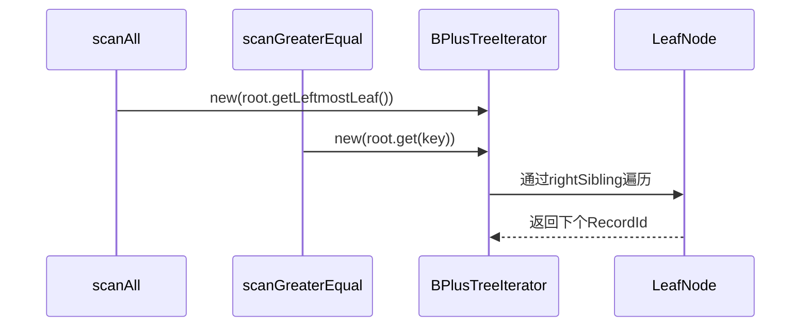

直接写迭代器：

```java
private class BPlusTreeIterator implements Iterator<RecordId> {
        // TODO(proj2): Add whatever fields and constructors you want here.
        private LeafNode currentLeafNode;
        private int currentIndex;

        public BPlusTreeIterator(LeafNode startLeafNode, int startIndex) {
            this.currentLeafNode = startLeafNode;
            this.currentIndex = startIndex;
        }

        @Override
        public boolean hasNext() {
            // TODO(proj2): implement
            if (currentLeafNode == null) {
                return false;
            }
            // 处理叶节点遍历完需要跨叶
            if (currentIndex >= currentLeafNode.getKeys().size()) {
                currentLeafNode = currentLeafNode.getRightSibling().orElse(null);
                currentIndex = 0;
            }
            return currentLeafNode != null && currentIndex < currentLeafNode.getKeys().size();
        }

        @Override
        public RecordId next() {
            // TODO(proj2): implement
            if (!hasNext()) {
                throw new NoSuchElementException();
            }

            RecordId rid = currentLeafNode.getRids().get(currentIndex);
            currentIndex++;

            return rid;
        }
    }
```

回去写一下那两个函数，通过传入构造函数的参数不同来实现：

首先是`scanAll`函数：

```java
public Iterator<RecordId> scanAll() {
        // TODO(proj4_integration): Update the following line
        LockUtil.ensureSufficientLockHeld(lockContext, LockType.NL);

        // TODO(proj2): Return a BPlusTreeIterator.
        return new BPlusTreeIterator(root.getLeftmostLeaf(), 0);
    }
```

然后是`scanGreaterEqual`函数：

```java
public Iterator<RecordId> scanGreaterEqual(DataBox key) {
        typecheck(key);
        // TODO(proj4_integration): Update the following line
        LockUtil.ensureSufficientLockHeld(lockContext, LockType.NL);

        // TODO(proj2): Return a BPlusTreeIterator.
        LeafNode startLeaf = root.get(key);
        if (startLeaf == null) {
            return Collections.emptyIterator();
        }
        int index = startLeaf.getKeys().indexOf(key);
        return new BPlusTreeIterator(startLeaf, index);
    }
```

运行之前没通过的测试：

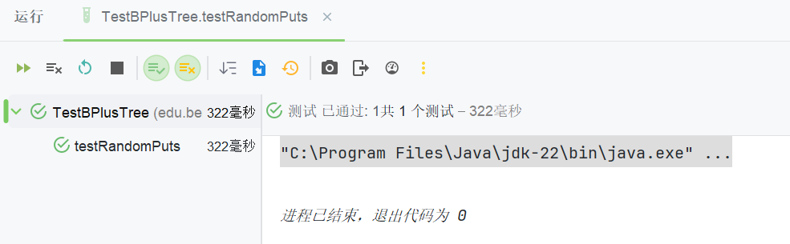

成功，**Task3**结束🤩！

## Task 4: Bulk Load

> Much like the methods from the Task 2 you'll need to implement `bulkLoad` within all three of `LeafNode`, `InnerNode`, and `BPlusTree`. Since bulk loading is a mutating operation you will need to call `sync()`. Be sure to read the instructions in [`BPluNode::bulkLoad`](https://github.com/berkeley-cs186/sp25-rookiedb/blob/master/src/main/java/edu/berkeley/cs186/database/index/BPlusNode.java#L162) carefully to ensure you split your nodes properly. We've provided a visualization of bulk loading for an order 2 tree with fill factor 0.75 ([powerpoint slides here](https://docs.google.com/presentation/d/1_ghdp60NV6XRHnutFAL20k2no6tr2PosXGokYtR8WwU/edit?usp=sharing)).
> 
> After this, you should pass all the Project 2 tests we have provided to you (and any you add yourselves)! These are all the provided tests in [`database.index.*`](https://github.com/berkeley-cs186/sp25-rookiedb/tree/master/src/test/java/edu/berkeley/cs186/database/index).

先写`LeafNode`部分：这部分要注意的就是分裂时要保留maxSize，移出1个元素到新节点，其余部分跟`put`的实现有些类似：

```java
public Optional<Pair<DataBox, Long>> bulkLoad(Iterator<Pair<DataBox, RecordId>> data,
            float fillFactor) {
        // TODO(proj2): implement
        // 计算填充阈值，向上取整
        int maxSize = (int)Math.ceil(2 * metadata.getOrder() * fillFactor);

        while (data.hasNext() && keys.size() <= maxSize) {
            Pair<DataBox, RecordId> entry = data.next();
            keys.add(entry.getFirst());
            rids.add(entry.getSecond());
        }

        if (!data.hasNext()) {
            sync();
            return Optional.empty();
        }

        // 分裂
        List<DataBox> rightKeys = keys.subList(maxSize, keys.size());
        List<RecordId> rightRids = rids.subList(maxSize, rids.size());

        LeafNode rightNode = new LeafNode(metadata, bufferManager, rightKeys, rightRids, this.rightSibling, treeContext);

        keys = new ArrayList<>(keys.subList(0, maxSize));
        rids = new ArrayList<>(rids.subList(0, maxSize));
        this.rightSibling = Optional.of(rightNode.getPage().getPageNum());
        sync();

        return Optional.of(new Pair<>(rightNode.getKeys().get(0), rightNode.getPage().getPageNum()));
    }
```

测试：

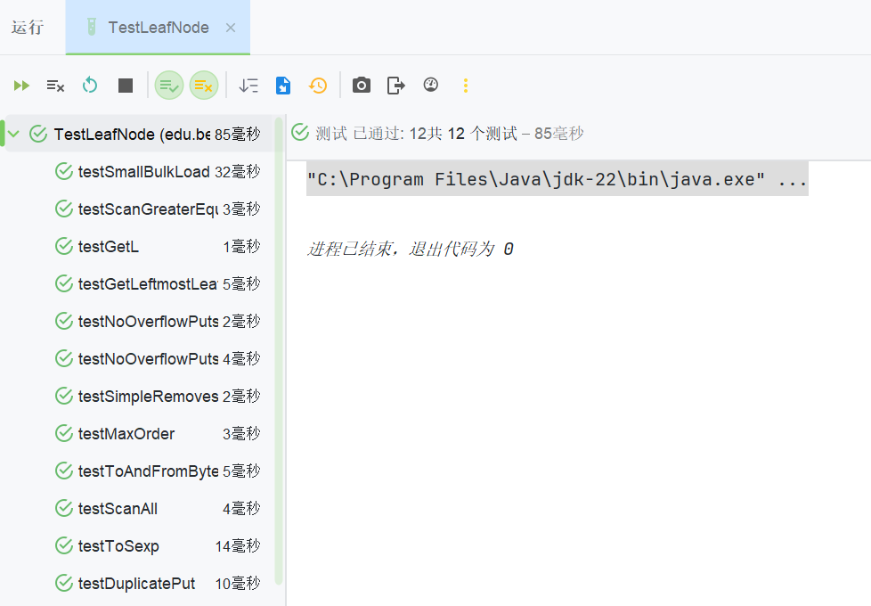

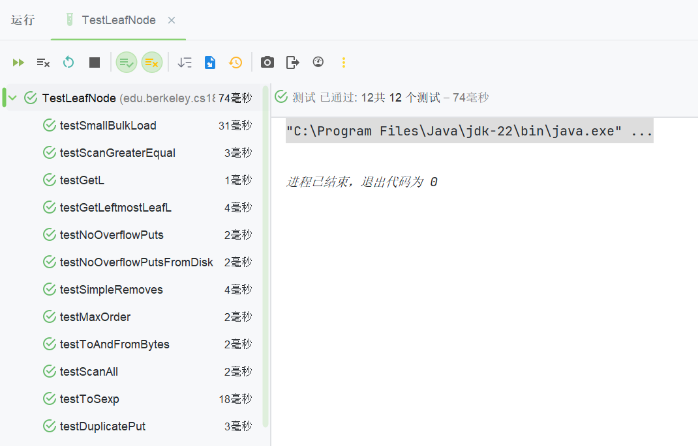

全部通过。

然后写`InnerNode`的部分，也很类似。

```java
public Optional<Pair<DataBox, Long>> bulkLoad(Iterator<Pair<DataBox, RecordId>> data,
            float fillFactor) {
        // TODO(proj2): implement
        int maxSize = (int)Math.ceil(2 * metadata.getOrder());

        while (data.hasNext() && keys.size() < maxSize) {
            BPlusNode rightMostChild = getChild(children.size() - 1);
            Optional<Pair<DataBox, Long>> result = rightMostChild.bulkLoad(data, fillFactor);

            if (result.isPresent()) {
                Pair<DataBox, Long> splitResult = result.get();
                keys.add(splitResult.getFirst());
                children.add(splitResult.getSecond());
            }
        }

        if (!data.hasNext()) {
            sync();
            return Optional.empty();
        }

        int mid = metadata.getOrder();
        DataBox splitKey = keys.get(mid);
        List<DataBox> rightKeys = new ArrayList<>(keys.subList(mid + 1, keys.size()));
        List<Long> rightChildren = children.subList(mid + 1, children.size());
        InnerNode right = new InnerNode(metadata, bufferManager, rightKeys, rightChildren, treeContext);

        keys = new ArrayList<>(keys.subList(0, mid + 1));
        children = new ArrayList<>(children.subList(0, mid + 1));

        sync();
        return Optional.of(new Pair<>(splitKey, right.getPage().getPageNum()));
    }
```

`BPlusTree`调用`InnerNode`的函数以及新建节点的思路基本与`put`一样。`put`写出来以后这个还是比较简单的：

```java
public void bulkLoad(Iterator<Pair<DataBox, RecordId>> data, float fillFactor) {
        // TODO(proj4_integration): Update the following line
        LockUtil.ensureSufficientLockHeld(lockContext, LockType.NL);

        // TODO(proj2): implement
        // Note: You should NOT update the root variable directly.
        // Use the provided updateRoot() helper method to change
        // the tree's root if the old root splits.
        if (scanAll().hasNext()) {
            throw new RuntimeException("Tree is not empty");
        }

        while (data.hasNext()) {
            Optional<Pair<DataBox, Long>> result = root.bulkLoad(data, fillFactor);
            if (result.isPresent()) {
                Pair<DataBox, Long> pair = result.get();
                List<DataBox> keys = new ArrayList<>();
                List<Long> children = new ArrayList<>();
                keys.add(pair.getFirst());
                children.add(root.getPage().getPageNum());
                children.add(pair.getSecond());
                InnerNode newRoot = new InnerNode(metadata, bufferManager, keys, children, lockContext);
                updateRoot(newRoot);
            }
        }
        return;
    }
```

测试通过：

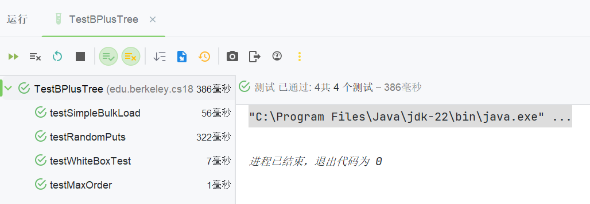

最后，按照教程运行`CommandLineInterface`代码启动**CLI**，这时候就可以使用数据库命令来调用我们刚写的代码了：

```powershell
"C:\Program Files\Java\jdk-22\bin\java.exe" "-javaagent:C:\Users\ASUS\AppData\Local\Programs\IntelliJ IDEA Ultimate 2024.3\lib\idea_rt.jar=61448" -Dfile.encoding=UTF-8 -Dsun.stdout.encoding=UTF-8 -Dsun.stderr.encoding=UTF-8 -classpath F:\cs186\cs186-sp25-rookiedb\target\classes edu.berkeley.cs186.database.cli.CommandLineInterface

\|/  ___------___
 \__|--o______o--|
    |  berklee   |
     ---______---

Welcome to RookieDB (v1.8.6-fa24)
=> SELECT * FROM Students AS s WHERE s.sid = 1;
 sid | name              | major     | gpa
-----+-------------------+-----------+-----------
   1 | Augustina Mazzoni | Chemistry | 1.0054202
(1 row)
=> CREATE INDEX on Students(sid);
CREATE INDEX ON Students (sid)
=> exit
exit
Bye!

进程已结束，退出代码为 0
```

一切顺利，那么到这里**Project2**就算彻底结束了，只不过遗憾的是没法上传到**Gradescope**上看看得分情况，希望后面运行的时候不要爆雷啊😰

## 总结

这次的作业关键还是在于熟悉项目结构以及体会**B+树**的存储设计，再结合一些**CS61B**的基础，难度适中，**Task2**可能需要更多的阅读代码理解各个函数的功能并调用。设计层面的内容也跟**CS61B**挺像的，不过写**CS61B**的项目时候一直有点晕晕的，还有点靠AI没有好好体会，这次也算是弥补一下。